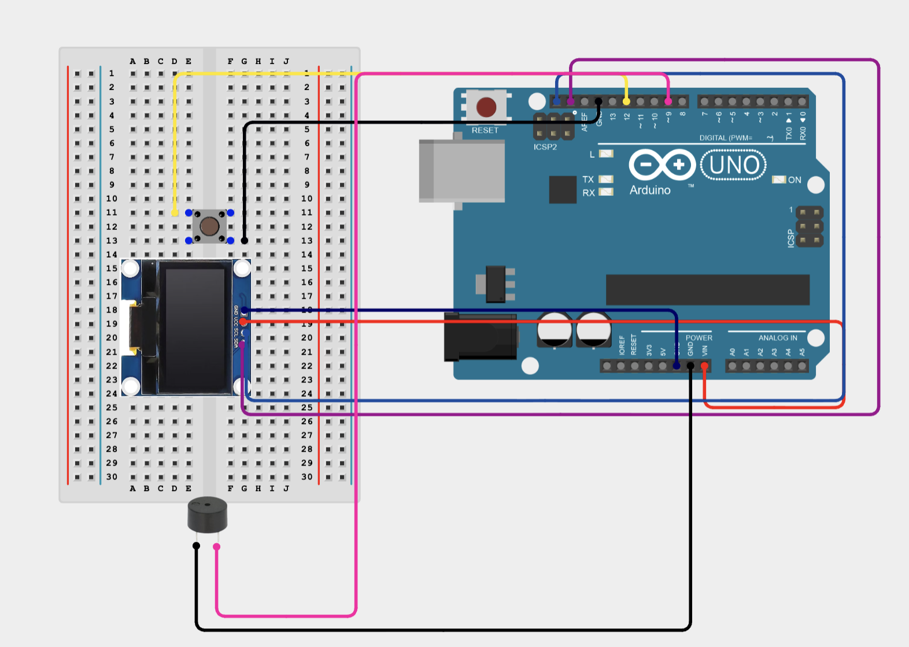

# Hardware Notifications MCP Server

Physical notifications (OLED display + buzzer) for any MCP-capable agent. Prevents leaving an agent working only to find it waiting for input.

## Quick Start

1. Build the circuit (see [Wiring](#wiring) below)
2. Install ClaudeNotifications: `curl -sSL https://raw.githubusercontent.com/arush-garg/ClaudeNotifications/refs/heads/main/setup.sh | bash` (this installs it globally to `~/.notifications/`. If you want to install it in a project, add `--local` flag and run it inside your project directory.)
3. Edit `config.json`
4. Add MCP to your agent config (see below)
5. Connect the microcontroller to your computer


#### Notes
1. Installing the MCP server with `setup.sh` also installs the Arduino CLI and adds it to your path
2. Installing the MCP server also adds hooks to your agent (Claude Code only for now). You can manually add hooks to your agent if you want to use the notifications server with other agents (see below)
3. The MCP server will automatically compile and upload the Arduino firmware on first run (or when `config.json` changes)

### Configure

Edit `config.json` at project root:

```json
{
  "baud_rate": 9600,
  "screen_width": 128,
  "screen_height": 64,
  "text_size": 1,
  "text_color": "white",
  "num_beeps": 3,
  "notification_duration": 60,
  "buzzer_pin": 8,
  "serial_port": "/dev/cu.usbmodem2101"
}
```

## MCP Client Integration

```json
{
  "mcpServers": {
    "notifications": {
      "command": "uv",
      "args": ["run", "--project", "<PATH_TO_NOTIFICATIONS_SERVER>", "--directory", "<PATH_TO_NOTIFICATIONS_SERVER>", "python", "main.py"]
    }
  }
}
```

<i>Don't worry about finding the correct path to the notifications server. The `setup.sh` script will print it out for you after installation.</i>

## Exposed Tools

| Tool | Description |
|------|-------------|
| `send_notification(message, beeps, duration)` | Show message on OLED, beep buzzer |
| `get_status()` | Check hardware connection |
| `flash_firmware(port)` | Compile & upload Arduino firmware |

## Hook Integration (Claude Code)

Auto-notify when agent asks clarifying questions:

### `.claude/settings.json` (global) or `.claude/settings.local.json` (project)
```json
{
  "hooks": {
    "PreToolUse": [{
      "matcher": "AskUserQuestion",
      "hooks": [{
        "type": "command",
        "command": "python3 /path/to/project/.claude/hooks/ask.py"
      }]
    }]
  }
}
```
<i>It is possible to add hooks for other agents. You might have to edit hooks/ask.py to match your agent's tool format.</i>

## Wiring

```
Arduino Uno          SSD1306 OLED
─────────────────    ────────────────
5V                 → VCC
GND                → GND
A4 (SDA)           → SDA
A5 (SCL)           → SCL

Arduino Uno          Buzzer
─────────────────    ──────────────
Pin 9                → +
GND                  → -

Arduino Uno          Push Button
─────────────────    ────────────────
Pin 12                → One side of button
GND                  → Other side of button
```

